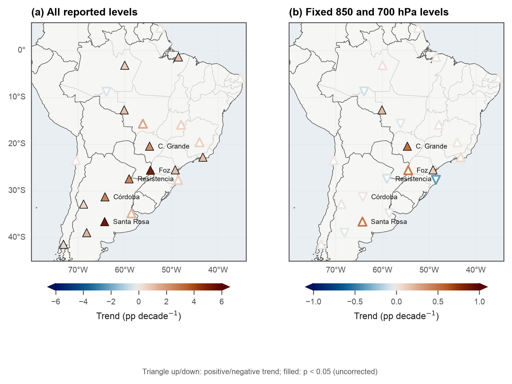
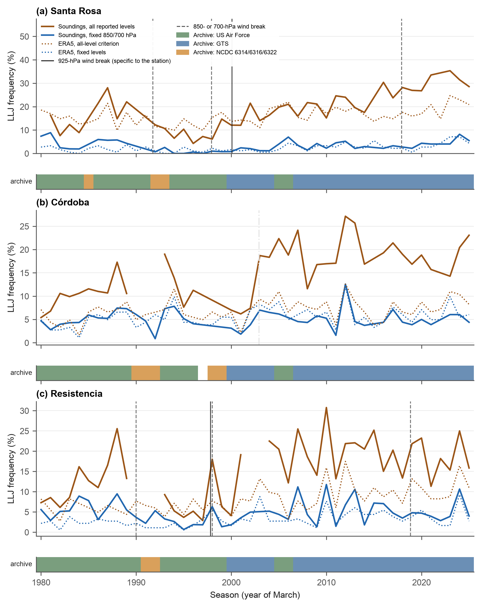
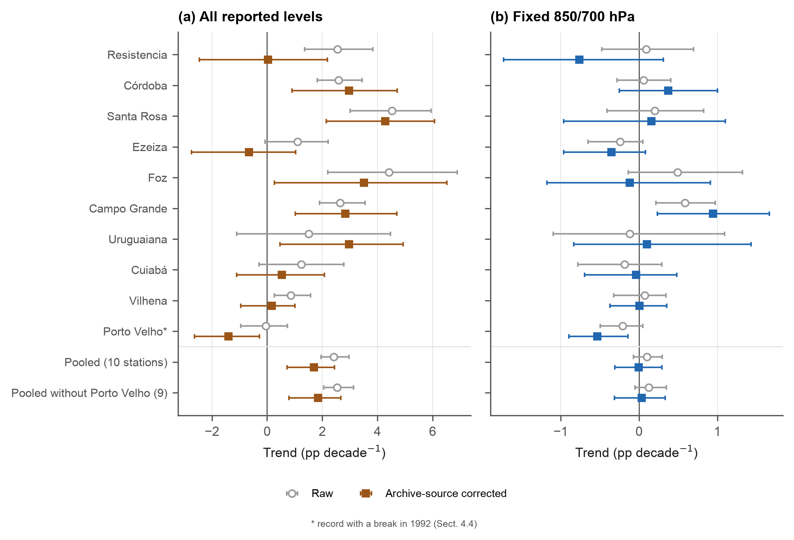
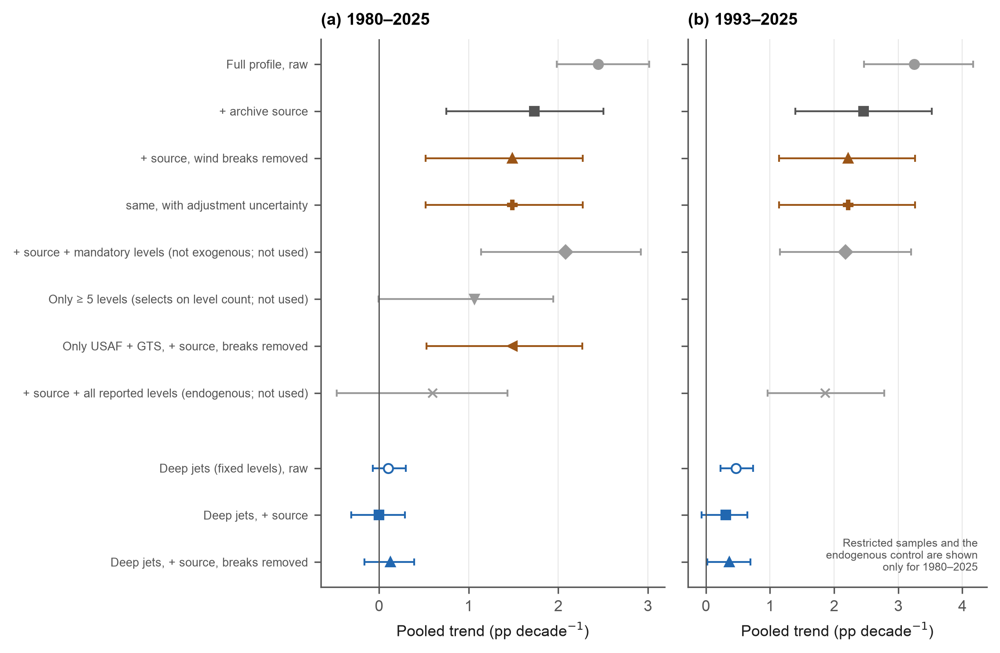
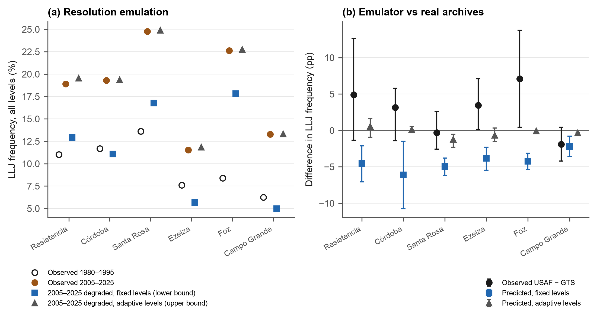
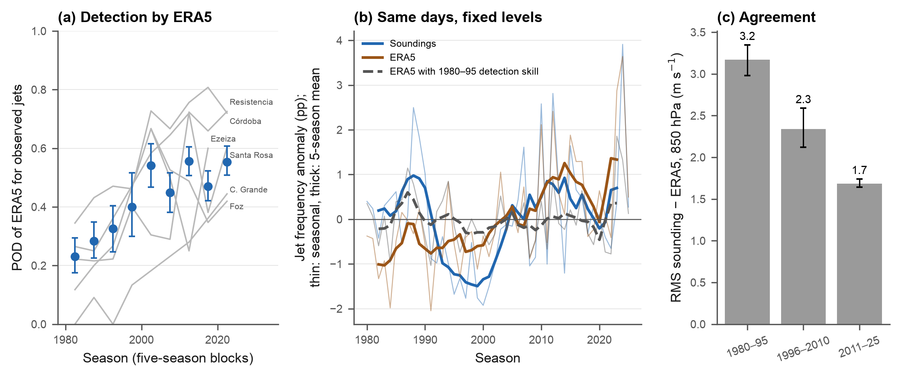
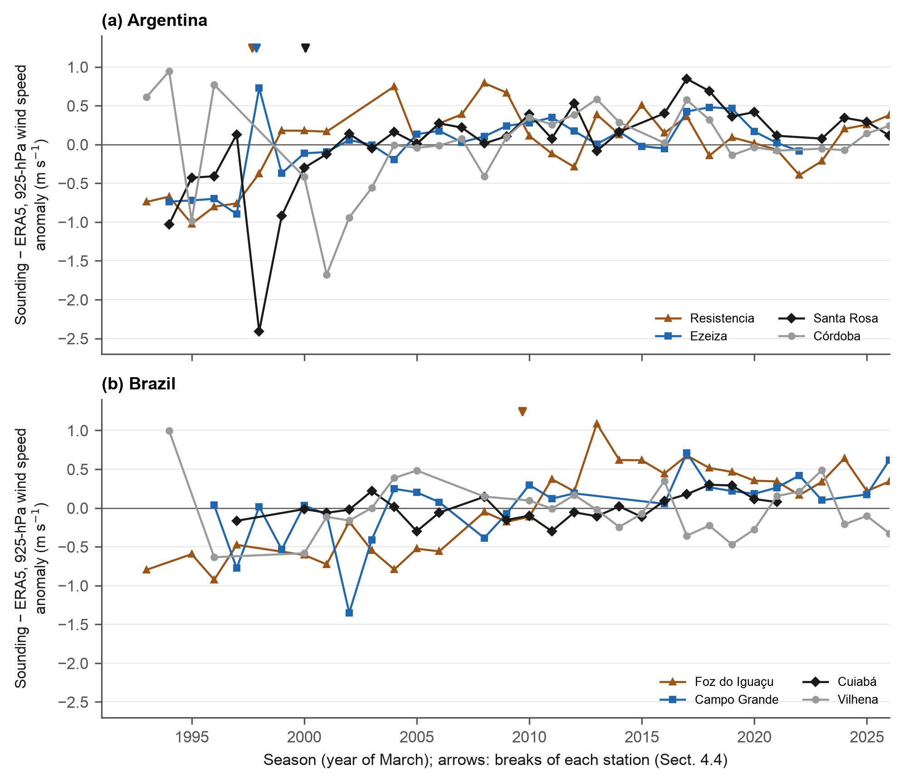
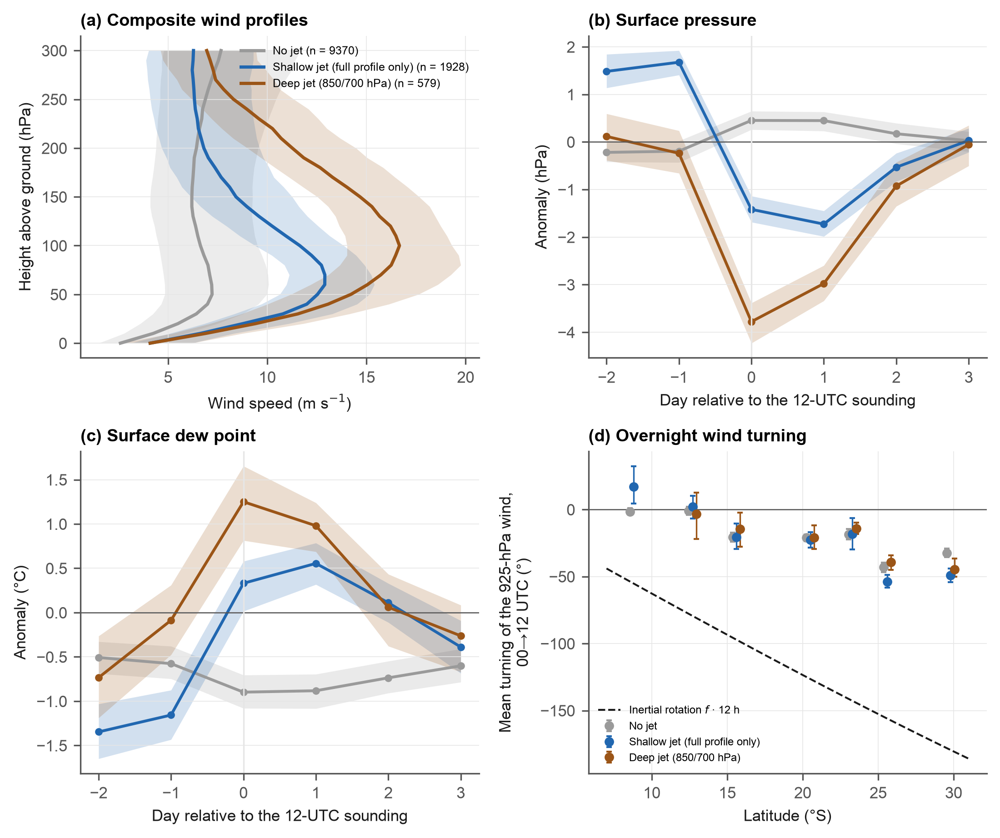
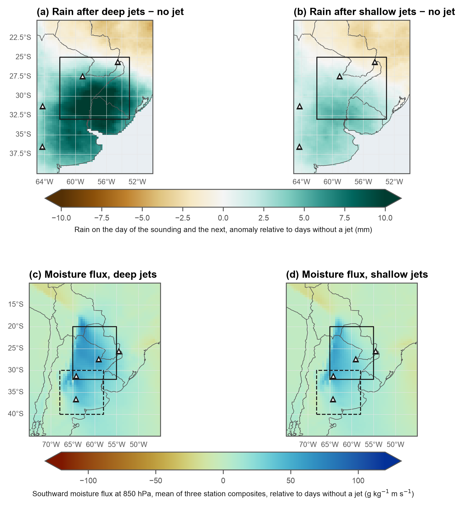

# Has the South American low-level jet changed? Radiosonde evidence and the limits set by the observing system, 1980–2025

**Juan Nesis**

Independent researcher, Buenos Aires, Argentina. Corresponding author: juannesiss@gmail.com

**Running title:** Has the South American low-level jet changed?

**Keywords:** low-level jet; radiosondes; observing system; homogeneity; ERA5; South America; trends

## Abstract

Reanalyses indicate that the South American low-level jet (SALLJ) has changed in frequency, but these trends have not been checked against long radiosonde records. Using warm-season soundings from 31 stations in 1980–2025, we show that the answer depends on the detection criterion and on record homogeneity. Counting jets in the full sounding profile gives +2.4 percentage points per decade (pp decade⁻¹; 95 % interval 2.0 to 3.0). Controlling for source archive and for wind breaks of 0.8–1.1 m s⁻¹ at 925 hPa in the Argentine stations reduces this by 30–40 % (+1.5; 0.5 to 2.3). The remainder is not established: trends within homogeneous archive eras are not significant, and the increase concentrates in an Argentine step of +5 to +7 pp whose best-fitting date, 2003, coincides with the archive transition. An index of deep jets, detected with two levels reported throughout the record (shallow jets are detected only with the full profile), shows no trend (+0.0; −0.3 to +0.3), but sounding noise of 2–3 m s⁻¹, a sensitivity scenario rather than a bound, could hide +0.3 to +0.8 pp decade⁻¹. Agreement between ERA5 and the soundings improved markedly (rms difference of the 850-hPa wind 3.5 to 1.7 m s⁻¹; fraction of observed jets detected 0.28 to 0.53, mostly in a step near 1993), so trends of ERA5 over the whole period mix the climate signal with that change. Shallow jets are nocturnal and prefrontal.

## 1. Introduction

The South American low-level jet carries moisture from the Amazon to the subtropical plains east of the Andes. It flows along the Andes, peaks at night and in the early morning, and penetrates south of 25°S as a Chaco jet on about 17 % of summer days (Salio et al., 2002; Marengo et al., 2004; Vera et al., 2006). Jet events organize convection at their exit region (Saulo et al., 2007; Salio et al., 2007) and supply a large share of the summer rainfall of northern Argentina and Paraguay, so changes in jet frequency matter for the water cycle of the La Plata basin (Berbery and Barros, 2002).

Several studies have reported such changes. Jones (2019) found increasing jet occurrence in the northern branch along the eastern Andes over 39 years. Montini et al. (2019) found significant increases of the northwesterly vertically integrated moisture transport on jet days towards southern Brazil in 1979–2016. Mu et al. (2024) examined frequency and intensity trends of three jet types over 65 years and related them to the Pacific Decadal Oscillation and ENSO; they report a significant decrease of the frequency of the central type and increases of the northern and Andes types. These studies rely on reanalyses, which are usually validated against short field campaigns: Montini et al. (2019) showed that reanalysis wind profiles compare well with soundings of the 2002–2003 South American Low-Level Jet Experiment, and later ERA5 climatologies cite that agreement to justify their use over four decades (Jones et al., 2023). A short campaign says nothing about whether the agreement is constant in time.

There are reasons to doubt that it is. The observing system over South America changed profoundly after 1980, with satellite winds, aircraft reports and changes in the radiosonde network itself, and such changes can produce spurious trends in reanalyses (Bengtsson et al., 2004). Radiosonde wind records are not free of these problems either: changes of instrument, wind-finding system and reporting practice introduce breaks (Gruber and Haimberger, 2008). Studies that detect jets from the full sounding profile (Oliveira et al., 2018; Sasaki et al., 2022) are exposed to a further problem, because the number of levels reported per sounding has changed over time.

Here we use 46 years of soundings from 31 stations in South America, mostly in the La Plata basin, to quantify how much the jet frequency has changed and how much of the apparent change comes from the observing system. We detect jets with the full-profile criterion used in recent studies and with a criterion based on two levels reported throughout the period, remove the effect of archive sources and of wind breaks identified against ERA5, bracket the effect of vertical resolution and of sounding noise with emulations, and characterize the jets that high-resolution soundings add. Finally, we ask whether the agreement between ERA5 and the soundings is stationary and whether ERA5 inherits their breaks.

## 2. Data

**Radiosondes.** We use the Integrated Global Radiosonde Archive version 2 (IGRA v2; Durre et al., 2006; Durre and Yin, 2008). We selected the 31 stations between 5°N and 45°S and between 82°W and 34°W whose IGRA records begin before 1986, extend beyond 2019 and contain at least 7000 soundings in the complete record; they provide 496 825 soundings in 1979–2025 (Table S1). The soundings at 12 UTC in October–March start later than the IGRA record at several stations (Table S1), because earlier soundings are at other hours. To examine the northern branch of the jet we added six stations in Venezuela, Colombia and the southern Caribbean (the seventh northern station, Boa Vista, belongs to the 31). Each sounding is analyzed with all mandatory and significant levels, its reported release time, and the IGRA code of the source archive. The records of the La Plata basin combine four main sources: the NCDC archives 6316 and 6322 (and, at some stations, 6314), the US Air Force archive (usaf-ds3, 1979–2006) and the soundings received through the Global Telecommunication System (ncdc-gts, from about 2000). Station history metadata of IGRA end between 1989 and 1997 and document the introduction of Vaisala RS80 sondes in 1989–1991 and a change of sonde type in December 1992 at Resistencia and Córdoba; they cannot be used to date later changes.

**Surface observations.** Hourly wind, temperature, dew point and sea-level pressure (SLP) from the NOAA Integrated Surface Database for the airports of Resistencia, Córdoba, Santa Rosa and Ezeiza, 1980–2025. Pressure is always SLP; altimeter settings are not used.

**Climate indices.** The Oceanic Niño Index (NOAA Climate Prediction Center), the Pacific Decadal Oscillation index (Mantua et al., 1997; ERSST-based) and the Southern Annular Mode index of Marshall (2003).

**Rain.** Daily CHIRPS v2.0 precipitation at 0.25° (Funk et al., 2015) over 40–20°S, 65–50°W, October 1997–March 2025.

**Reanalysis.** ERA5 (Hersbach et al., 2020): wind components at 12 levels between 1000 and 700 hPa at 00 and 12 UTC, October–March 1979–2025, at the grid point nearest to 11 stations along the jet path, and wind and specific humidity at 850 hPa over 10–45°S, 75–45°W for composites. The profiles end at 700 hPa; truncating the observed profiles at 700 hPa does not change the comparisons (Section 4.7).

## 3. Methods

### 3.1 Jet detection

We detect northerly low-level jets with the first criterion of Bonner (1968), as adapted by Salio et al. (2002) and Oliveira et al. (2018): a wind maximum of at least 12 m s⁻¹ and a decrease of at least 6 m s⁻¹ from the maximum to the minimum above it. The wind at the core must blow from 292.5° to 67.5° (the same window in all criteria). We apply the criterion in three ways:

- **Full profile:** the maximum is sought between the surface and 250 hPa above it (about the lowest 2.5 km), the decrease is measured up to 300 hPa above the surface (about 3 km), and every reported level is used. Soundings with fewer than three levels in the layer are not evaluated.
- **Standard levels:** the same criterion with the surface and the standard levels 1000, 925, 850, 700 and 500 hPa.
- **Fixed levels:** the 850-hPa wind is at least 12 m s⁻¹ from the northerly window and exceeds the 700-hPa wind by at least 6 m s⁻¹ (Salio et al., 2002). These two levels were reported throughout the period; we call the jets they detect *deep jets*. Because 850 hPa lies at very different heights above the ground (about 0.4 km at Córdoba and 1.5 km at Ezeiza), the criterion samples different parts of the jet at different stations; we use it for trends at each station and pooled with station effects, not for comparisons of frequency between stations.

Heights are expressed as pressure above the surface, because soundings received through the Global Telecommunication System lack geopotential height at significant levels. We analyse the warm season (October–March) at 12 UTC, the hour at which all stations launch.

### 3.2 Trends, homogeneity and multiplicity

Seasonal jet frequencies require at least 60 soundings. Trends at each station are Theil–Sen slopes (Sen, 1968) with the Mann–Kendall test (Mann, 1945) corrected for autocorrelation (Hamed and Rao, 1998). Pooled trends come from linear probability models of the daily jet indicator on month, station, archive source and a linear trend, with 95 % intervals from resampling whole seasons (which respects the autocorrelation within seasons; at least 1000 replicates unless stated, fixed seeds). Equivalence tests use the 90 % interval, as the TOST requires. The descriptive comparisons of Sections 4.6 and 4.7 (exploratory, not used for the main claims) report 90 % intervals, stated where they are given. Because Theil–Sen slopes of rare events are degenerate, we also fit a pooled logistic model and report odds ratios per decade. Trends are given in percentage points per decade (pp decade⁻¹) and as a percentage of the mean frequency per decade. For the deep-jet index we adopt, by convention and not preregistered, a smallest effect of interest of ±10 % of the mean per decade (about ±0.3 pp decade⁻¹) and test equivalence with two one-sided tests (TOST; Schuirmann, 1987; Lakens, 2017) at 5 % (the 90 % interval must lie inside the margin); variants of ±15 and ±20 % are also given. A break in the pooled series is estimated by a continuous two-segment linear fit with the break date chosen by least squares between 1988 and 2012, with intervals by season resampling. Multiple testing across stations is controlled with the false discovery rate (Benjamini and Hochberg, 1995; q = 0.10; Wilks, 2016).

The analyses use different sets of stations: 22 stations with at least 20 seasons for trends by station (Fig. 1); ten stations along the jet path for the pooled analyses (Resistencia, Córdoba, Santa Rosa, Ezeiza, Foz do Iguaçu, Campo Grande, Uruguaiana, Cuiabá, Vilhena and Porto Velho; Table S1), with leave-one-out tests; 11 stations for the comparison with ERA5; seven Brazilian stations with soundings at 00 and 12 UTC for the nocturnal analyses; and the four Argentine airports for the surface analyses.

### 3.3 Wind breaks

Breaks in the wind records are sought with the standard normal homogeneity test (SNHT; Alexandersson, 1986) in monthly series of the difference between the wind speed of each sounding and that of the nearest ERA5 grid point on the same days (925, 850 and 700 hPa), following the logic of the RAOBCORE and RICH homogenizations (Haimberger, 2007; Haimberger et al., 2012) and the comparison with neighboring stations of Menne and Williams (2009) and Gruber and Haimberger (2008). A binary segmentation with at least 18 monthly values per segment is used, with significance by permuting blocks of three consecutive years (1000 permutations, fixed seed), which preserves part of the interannual persistence. The family of tests for the control of the false discovery rate (Benjamini–Hochberg, q = 0.10, with a ceiling of p ≤ 0.05) contains every node tested in the 30 series (three levels, ten stations), including those that do not pass; cuts that do not reappear (within three months) with five other seeds are discarded. We do not subtract a reference of stations without breaks: such a reference exists only from about 1996, which would make the method blind to the 1980s, and the Argentine network changed as a block. Instead, each break is compared with the mean change of the sounding-minus-ERA5 difference at the stations of the other country (Brazil for the Argentine stations and vice versa) in the six years before and after; if that control moves in the same direction by at least half as much, the break is considered regional (a drift of ERA5 or a climate signal) and is not adjusted. Because ERA5 assimilates these soundings, the departures understate the breaks. To quantify their effect on the jets, each segment of the wind speed at 925, 850 and 700 hPa is shifted to the level of the last segment (an additive adjustment, which assumes that the instrument bias does not depend on the wind speed), and the profile in between is adjusted by interpolation in the logarithm of pressure. Months without enough pairs take the adjustment of the neighboring segment. The uncertainty of the adjustments is propagated to the adjusted trends by perturbing the magnitude of each adjustment with the error of the segment mean and, for the full profile, also the date of each cut by ±12 months (60 replicates; 200 for the fixed levels); it does not include the uncertainty of whether a cut exists.

### 3.4 Controls on the full-profile trend

We control the pooled full-profile trend in steps: archive source; number of reported levels in the lowest 250 hPa; and the wind breaks of Section 3.3. The number of levels is treated in two ways. The number of mandatory levels (1000, 925, 850, 700 and 500 hPa) reported in the layer is set by regulation, but it is not exogenous to the wind: soundings that report 925 hPa have a stronger 850-hPa wind (+1.14 m s⁻¹; Section 4.4), so this control is reported for completeness and is not treated as a valid one. The total number of levels includes significant levels, which observers insert where the wind profile has features; it is therefore larger in soundings with a jet and is not a valid control, because it conditions on a consequence of the outcome. We report it only for comparison. We also restrict the sample to the US Air Force and GTS archives (excluding the NCDC archives of one to four levels) and leave out each station in turn.

### 3.5 Vertical resolution and sounding noise

To bracket the effect of vertical resolution, we degrade modern soundings to the resolution of old ones. For each sounding of 2005–2025 we draw 10 soundings of the same station and calendar month from an earlier period, interpolate the modern wind linearly in the logarithm of pressure to the levels, expressed as pressure above the surface, that each old sounding reported, and average the jet indicator over the draws. Observers choose significant levels where the profile has features, so this emulator is not adaptive and gives a lower bound on what an old archive would have detected; we add an adaptive variant, which also keeps the true levels of the wind maximum and of the minimum above it, as an upper bound. The emulator is validated in seasons in which the US Air Force and GTS archives both contribute at least 20 soundings, comparing the observed difference in jet frequency with the one predicted by applying templates of the Air Force archive to the GTS soundings.

Noise acts in the opposite direction to resolution: the jet criteria are thresholds on the tail of the wind distribution, and random error inflates the frequency of exceedances. The rms difference between sounding and ERA5 winds fell by a factor of two (Section 4.7), which may reflect less noisy soundings, a better ERA5, or both, and for jet days includes regression to the mean and representativeness error, so it gives no bound on the sounding noise. As a sensitivity scenario we add Gaussian noise of 1, 2, 3 and 5 m s⁻¹ to each wind component at each level of the modern soundings, independent or correlated in the vertical (scale 0.15 in ln p), apply the rounding of the old archives (speed to whole knots, direction to 10°), and convert the rise of the jet frequency into a trend bias by dividing by the 2.65 decades between the mean years of 1980–1992 and 2001–2025.

### 3.6 Comparison with ERA5

We apply the fixed-level criterion to the ERA5 profile at the nearest grid point, discarding levels below the median surface pressure of the station, and compare it day by day with the soundings. Skill is summarized by the probability of detection (POD), the false alarm ratio (FAR), the probability of false detection, the frequency bias and the equitable threat score, for the stations with at least 40 observed jets and, to rule out changes of composition, for the five stations with at least 20 observed jets in each of three periods. On days with an observed jet, a logistic regression of detection on time, with station effects, controls for the 850-hPa speed and the 850–700 hPa decrease of the observed jet; the date of an abrupt change is estimated by maximum likelihood. To attribute the trend of ERA5 we use the identity ERA5 frequency = POD × observed frequency + false-alarm frequency, and recompute it with each station's POD held at its 1980–1995 value; this accounting does not constitute an independent test. The nocturnal comparisons (Supplement S1) are repeated conditioning on ERA5 jets, to rule out regression to the mean.

### 3.7 Jet classes and their physics

We call a day a deep-jet day if the fixed-level criterion detects a jet, a shallow-jet day if only the full-profile criterion does, and a no-jet day otherwise (classes A, B and C in the code). Paired 00 and 12 UTC soundings at seven Brazilian stations, the inertial turning of the 925-hPa wind, surface observations at four Argentine airports, CHIRPS rain and the height of the jet core are used to ask whether shallow jets are a different phenomenon from deep jets; the definitions and results are in Supplement S1 and are exploratory.

### 3.8 Use of AI tools

During the preparation of this work the author used Claude (Anthropic) to write and run analysis code.

## 4. Results

### 4.1 Observed jet climatology

With the full-profile criterion, northerly jets appear in 15–20 % of warm-season soundings at the stations of the La Plata basin and its exit region (Foz do Iguaçu 20.5 %, Santa Rosa 19.4 %, Córdoba 16.1 % and Resistencia 15.7 % of all soundings of the period) and in less than 2 % west of the Andes (Antofagasta and Lima 0.3 %, Puerto Montt at 41°S 1.9 %). The fixed-level criterion finds jets in 3–5 % of soundings at the same stations (Resistencia 4.9 %, Córdoba 5.1 %, Foz do Iguaçu 4.2 %, Santa Rosa 3.4 %). The pattern agrees with previous radiosonde climatologies (Oliveira et al., 2018).

### 4.2 The full-profile jet frequency rose, but the rise cannot be separated from the changes in the observing system

With the full-profile criterion, jet frequency increased significantly at 13 of the 22 stations with sufficient data in 1980–2025, all 13 remaining significant after controlling the false discovery rate, by up to 5 pp decade⁻¹ at Santa Rosa (+5.2) and Foz do Iguaçu (+5.0; Fig. 1a). Pooled over ten stations, the raw trend is +2.4 pp decade⁻¹ (95 % interval 2.0 to 3.0), +20 % decade⁻¹ of the mean of 12.4 % (Fig. 4a). The series are not monotonic: at Santa Rosa, Córdoba and Resistencia the frequency was already high in the 1980s, fell to 4–6 % in the 1990s and rose after 2000 (Fig. 2).

IGRA combines soundings from several archives that differ in what they retain (Table S1). The NCDC archives (6314, 6316, 6322), which dominate parts of 1979–1994, report a median of 1–4 levels in the lowest 250 hPa and often lack the 850- or 700-hPa wind; the Air Force archive reports 5–8 levels and the GTS 7–8. The full-profile criterion responds erratically to the sparse archives (jets in 33 % of the 6316 soundings at Córdoba and in 0 % at Santa Rosa and Resistencia, against 11–14 % in the Air Force archive), and these archives coincide with the dip of the 1990s. In contrast, GTS minus Air Force differs by only −3.2 pp (90 % interval −5.8 to −0.5) at Córdoba, +0.3 (−2.6 to +3.2) at Santa Rosa and −4.9 (−11.2 to +1.3) at Resistencia.

Controlling for the archive source reduces the pooled trend to +1.7 pp decade⁻¹ (95 % interval 0.8 to 2.5) and removing the wind breaks of Section 4.4 to +1.5 (0.5 to 2.3), +12 % decade⁻¹ (Fig. 4a). Controlling for the number of mandatory levels gives +2.1 (1.1 to 2.9), but that control is not exogenous either (Section 3.4: reporting 925 hPa depends on the 850-hPa wind), and the control for all reported levels, which would give +0.6 (−0.5 to +1.4), is endogenous because significant levels are inserted at wind features; neither is used as a valid control, and their disagreement shows that the controls do not pin the trend down. Restricting the sample to the Air Force and GTS archives, which compare archives of similar resolution, gives +1.5 pp decade⁻¹ (0.5 to 2.3; +11 % decade⁻¹). Restricting the sample to soundings with at least five levels gives +1.1 (0.0 to +1.9), but that selection conditions on the endogenous number of levels, and we do not use it as evidence. Leaving each station out in turn gives +1.1 to +1.9 with source and break controls; the lowest value, +1.1 (−0.1 to +2.0), is without Santa Rosa. Since 1993 the corresponding values are +3.3 raw and +2.2 after source and break controls (1.1 to 3.3; +17 % decade⁻¹). The controls therefore reduce the raw trend by 30–40 %, that is, the raw count exceeds the controlled estimate by 40–65 %.

Three checks show that the remainder cannot be taken as an established increase. First, the source model is not consistent with the direct overlap of archives: it implies that the Air Force archive has 2.1 pp fewer jets than the GTS archive, whereas in the 21 station-seasons in which both contribute it has 2.7 pp more (90 % interval +0.4 to +5.1; Section 4.5), so the source coefficients absorb something other than a constant archive offset. Second, within homogeneous eras the trends are not significant: +0.6 pp decade⁻¹ (−1.9 to +2.0) for the Air Force archive in seasons up to 2006 and +0.8 (−0.7 to +2.4) for the GTS archive in 2006–2025 (+0.5 with the breaks removed). Significance appears only in the GTS seasons 2001–2025 (+1.9, 0.6 to 3.1), which start at the archive transition, and there it depends on one station: without Santa Rosa the Argentine trend of that era is +0.1 (−1.9 to +2.2), against +2.3 (0.9 to 3.6) with it, while the Brazilian stations give +1.7 (0.2 to 3.0). The eras have little power: their intervals of about ±2 pp decade⁻¹ would not detect a trend of the size reported. In fixed windows with source effects and the breaks removed, the trend is +1.5 (0.5 to 2.3) in 1980–2025, +2.2 (1.0 to 3.2) in 1993–2025, +1.7 (0.4 to 2.9) in 2001–2025 and +0.6 (−1.1 to +2.1) in 2006–2025; without Santa Rosa none of the four intervals excludes zero. Third, the increase is concentrated in a step: the change between the eight seasons before and after 1998, 2000 and 2003 is 6.6, 8.5 and 8.8 pp at the four Argentine stations against 1.1, 1.2 and 2.7 pp at the four or five Brazilian stations with at least four seasons in each window (one inclusion rule for all dates). The difference in differences, with month, station and archive-source effects, is +4.9 (1.3 to 7.6), +7.1 (4.2 to 9.2) and +5.5 pp (2.0 to 8.8); permuting which four of the nine stations are treated gives p = 0.09, 0.03 and 0.01. The three dates were chosen from the breaks of Section 4.4, so these are exploratory; the 1998 and 2000 windows overlap, and Córdoba, which has no 925-hPa break, is in the Argentine group (without it the differences are +7.0, +8.4 and +5.4). Allowing an Argentine step in the pooled model with source effects leaves a trend of +1.1 to +1.5 pp decade⁻¹ (+1.7 without a step), so the trend does not vanish; but the date that the data prefer for the step is the season 2003 (ΔAIC < 2 only for 2003 and 2004; 1997–2000 are 31–48 AIC units worse), which is the middle of the transition from the Air Force to the GTS archive and not the date of the 925-hPa breaks, so the step cannot be separated from that transition. By country, the pooled trend with source effects and breaks removed is +1.6 (0.4 to 2.7) in Argentina and +1.4 (0.4 to 2.4) in Brazil.

Not every sounding can be evaluated with the full profile (it needs at least three levels in the lowest 250 hPa): the evaluable fraction rises from 59 % in 1980–1992 to 78, 84 and 94 % in 1993–2000, 2001–2005 and 2006–2025 (7 % for the NCDC 6316 archive, 92 % for GTS). Imputing the frequency of each archive-station-month to the unevaluable soundings gives +1.5 pp decade⁻¹ (0.6 to 2.1) with source effects. Finally, the increase is mostly one of low-core jets: the trend of jets with the core above 50 hPa over the surface is +0.4 pp decade⁻¹ (−0.4 to +1.1) with source effects, and of those at or below it +1.3 (0.9 to 1.6); requiring the core to lie at least 10 or 30 hPa above the surface level leaves the full trend unchanged (+1.7 and +1.6 with source effects), and the surface level is reported in 91–100 % of the soundings of every archive. We conclude that the data are compatible with a modest real increase of 0 to about +2 pp decade⁻¹ and that they cannot separate it from the archive transition of 2000–2006 and the Argentine step.

### 4.3 Deep jets: no detectable change over the whole period, but not an exclusion of an increase

With fixed levels, trends are below 1 pp decade⁻¹ at every station; three are significant at the 5 % level (Campo Grande +0.50, Vilhena +0.20, Curitiba +0.11) and none after controlling the false discovery rate (Fig. 1b). The pooled trend (Fig. 3 and 4a) is +0.1 pp decade⁻¹ (95 % interval −0.1 to +0.3), +4 % decade⁻¹ of the mean of 2.9 %. With archive-source effects it is 0.0 (95 % interval −0.31 to +0.29), and with source effects and the wind breaks removed +0.13 (−0.16 to +0.39; −0.15 to +0.40 including the uncertainty of the adjustments); the pooled logistic odds ratio is 1.00 per decade. Leaving each station out gives −0.02 to +0.13. With the margin of ±10 % decade⁻¹ (±0.29 pp decade⁻¹), which we adopted by convention, equivalence is established at 5 % for the series with source effects and not for the series with the breaks removed (90 % upper bound +0.36), where it is established at ±15 %. The largest increase that cannot be excluded (95 % upper bound) is +10 to +14 % decade⁻¹.

The series is not stationary (Fig. 2). Averaged over ten stations, deep jets occur on 2.8 % of the days with soundings in 1980–1992, 1.7 % in 1993–2000 and 2.9 % in 2001–2025; ERA5 on the same days gives 1.6, 1.6 and 2.1 %. A two-segment fit places the break in 1996 (90 % interval 1994 to 1999), with a slope of −0.8 pp decade⁻¹ before (−1.3 to −0.5) and +0.4 after (+0.2 to +0.7; +15 % decade⁻¹), better than a straight line by AIC (−13.2 against −8.2; the AIC is not penalized for the search of the break date). The shape persists when the wind of each station is adjusted for its own breaks (slopes −0.6 before and +0.4 after; AIC −24.5 against −21.3 for the straight line; break date 1992 to 2000), so the detected breaks do not explain the dip of the 1990s, whose cause (decadal variability or an undetected instrumental change) we cannot determine. Excluding the seasons 1993–2000, the trend is +0.14 pp decade⁻¹ (90 % interval −0.09 to +0.40), and since 1993 +0.47 (90 % interval 0.27 to 0.69) raw and +0.37 (0.08 to 0.64; 95 % interval including the adjustment uncertainty +0.04 to +0.70) with source effects and the breaks removed; the odds ratio since 1993 is 1.11 (90 % interval 0.98 to 1.22) raw and 1.14 (1.02 to 1.28) adjusted.

Two limitations keep us from reading this as an absence of change. First, noise: adding Gaussian noise of 1, 2 and 3 m s⁻¹ per wind component to the modern soundings raises the deep-jet frequency from 4.0 % to 4.1, 4.9 and 6.2 % (+0.12, +0.91 and +2.2 pp), which, if the soundings of the 1980s were that noisy, would bias their trend downwards by +0.05, +0.34 and +0.83 pp decade⁻¹ (+2, +12 and +29 % decade⁻¹); noise correlated in the vertical gives +0.05, +0.31 and +0.65, and the rounding of the old archives has no effect (Section 3.5). For the full profile the corresponding values are +0.7, +2.5 and +4.8 pp decade⁻¹ with independent noise and +0.2, +0.8 and +1.8 with correlated noise, so noise of 2 m s⁻¹ could by itself produce the whole full-profile trend. These are sensitivity scenarios and not bounds: the rms difference with ERA5 halved, but it does not give the noise of the soundings. Second, the 850-hPa wind of the Argentine stations drops by 0.7 to 1.2 m s⁻¹ around 1990–1992, when sonde types changed (Section 4.4), which inflates the frequency of the 1980s. Taken together, the data are compatible with no change and with an increase of 10–20 % decade⁻¹.

The deep-jet index responds to known climate drivers, which shows only that it carries climate signal and not that it is homogeneous. Averaged over seven stations, its October–December anomaly correlates with the Oceanic Niño Index (r = +0.35, effective p = 0.018) and with the Pacific Decadal Oscillation (Mantua et al., 1997; r = +0.34, p = 0.036), and its October–March anomaly with the ONI (+0.36, p = 0.015); the correlations with the Southern Annular Mode (Marshall, 2003) are not significant, and the significant ones survive a false discovery rate control over six tests.

### 4.4 Wind breaks and independent checks

Comparing each sounding with ERA5 reveals breaks of the 925-hPa wind in the Argentine network (Fig. 7), where the other country serves as a control (Table S2). The wind speed increased by 1.12 m s⁻¹ at Resistencia (November 1997), by 0.80 m s⁻¹ at Ezeiza (October 1997) and by 0.78 m s⁻¹ at Santa Rosa (February 2000), while the Brazilian stations changed by −0.05 to +0.01 m s⁻¹ at the same dates; a break of 0.83 m s⁻¹ at Foz do Iguaçu (February 2010) is also specific to the station, and the one of Campo Grande (November 2003, +0.54) is regional (the Argentine control changes by +0.35) and is not adjusted. At Córdoba no break is significant at 925 hPa; the break of November 2002 found against neighbors alone is the end of the NCDC 6314 archive (149 soundings), not confirmed against ERA5. At 850 hPa, the wind of the Argentine stations falls by 1.19 m s⁻¹ at Resistencia (January 1990), 1.00 at Santa Rosa (October 1991) and 0.61 at Ezeiza (October 1992). Six years before and after November 1991 the sounding-minus-ERA5 difference at 850 hPa decreases at all four Argentine stations (−1.09, −0.47, −0.99 and −0.30 m s⁻¹ at Resistencia, Córdoba, Santa Rosa and Ezeiza) and does not at the Brazilian stations with data (+0.06 at Campo Grande, +0.23 at Vilhena). The timing agrees with the introduction of RS80 sondes recorded in the station histories (1989–1991) and implies that the Argentine winds of the 1980s are stronger relative to ERA5 than those of the 1990s. We adjust the breaks that are specific to a station, and the control shows that a drift of ERA5 does not explain them.

The 925-hPa series could be biased by the reporting of that level (only 33–40 % of the Air Force soundings report it): within the same station and season, soundings that report 925 hPa have a stronger 850-hPa wind (+1.14 m s⁻¹, 0.24 to 1.73), which would give higher departures before 2000 and hence a break of opposite sign to the one found.

The breaks of Resistencia and Ezeiza (late 1997) fall within weeks of the shutdown of the Omega radio-navigation system on 30 September 1997, which was used for radiosonde wind finding (Omega Navigation System, 2026); that of Santa Rosa (February 2000) does not, and we cannot attribute any of them to a specific instrument because the station histories end before 1997.

The independent checks do not discriminate. The geostrophic wind of the four-airport SLP plane increases across the dates of the breaks (the fraction of days with a northerly geostrophic flow of at least 4 m s⁻¹ goes from 31.9 to 38.2 %, from 29.3 to 41.2 % and from 32.4 to 41.6 % in the eight seasons before and after the Resistencia–Ezeiza, Santa Rosa and Córdoba dates) but decreases over the whole period (−2.0 pp decade⁻¹, p = 0.04), and surface anemometers have their own breaks. Part of the jump of the jet frequency at the breaks may therefore be real, which is why we identify the breaks from the departures from ERA5. Release times (reported since 2000) moved at the Argentine stations from about 11:10 to 11:35 UTC in 2015–2020, with no consistent effect on the jet frequency.

### 4.5 Vertical resolution and the two bounds of the emulation

The emulation brackets the effect of resolution but cannot pin it down. Degrading the modern soundings to the levels of 1980–1989 soundings at fixed positions gives a change at equal resolution of −1.3 pp (−2.6 to 0.0; five stations; −2.0 with the wind-break sensitivity), the adaptive upper bound is +6.0 pp (+4.5 to +7.4), close to the raw increase itself (Fig. 5a), and neither is informative alone. The validation shows that the fixed-position emulator is too pessimistic: in 21 station-seasons in which the Air Force and GTS archives coincide, the Air Force archive has on average 2.7 pp more jets than the GTS archive (90 % interval +0.4 to +5.1), whereas the fixed-level emulator predicts 4.3 pp fewer (−5.5 to −3.2) and the adaptive one 0.3 pp fewer (−0.7 to +0.1) (Fig. 5b). Archives with five to eight levels thus detect jets about as well as the GTS soundings in the same seasons, so the difference in resolution between the Air Force and the GTS archives is unlikely to explain by itself the rise after 2000; if the step at the archive transition (Section 4.2) is instrumental, it must come from other differences between the archives, such as the wind-finding system or station practice, which we cannot identify. Resolution matters mainly for the NCDC archives of one to four levels.

Within 2006–2025, when almost all soundings are of high resolution, the pooled trend is −0.2 pp decade⁻¹ (p = 0.67) for deep jets and +1.3 (p = 0.09) for shallow jets; the largest station trend is that of shallow jets at Santa Rosa (+7.1, p < 0.01), whose frequency rose from 16.5 % in 2008–2015 to 24.9 % in 2016–2025 while ERA5 shows 17.5 and 18.8 %. A search for breaks at Santa Rosa after the fact (July 2020, +1.0 m s⁻¹ relative to Córdoba and Ezeiza) is exploratory; we treat the station as a local inhomogeneity, and leaving it out changes the pooled adjusted full-profile trend with source effects from +1.5 to +1.1 pp decade⁻¹.

### 4.6 The jets that only high-resolution soundings reveal

Jets detected only with the full profile (shallow jets) are 2.4 to 5.4 times more frequent than deep jets at the stations with 00 and 12 UTC soundings in 1998–2025. They are not threshold noise: they occur mostly at night, follow the same prefrontal sequence as deep jets with weaker forcing, and are followed by a smaller rain anomaly (+0.5 mm against +5.0 mm after deep jets and −1.6 mm after days without a jet, 90 % intervals in Supplement S1); those with the lowest cores carry none. They resemble the shallow jets observed during the RELAMPAGO campaign (Sasaki et al., 2022). This is descriptive evidence (Supplement S1, Figs. S1 and S2) and it does not bear on the question of change, except that these jets are the ones the archives of one to four levels cannot resolve.

### 4.7 ERA5 against the soundings

**Agreement between ERA5 and the soundings has increased.** Of 1534 jets observed with fixed levels at ten stations, ERA5 detected 28 % in 1980–1995, 48 % in 1996–2010 and 53 % in 2011–2025 (Fig. 6a). For the stations with at least 40 observed jets (11 745, 16 324 and 21 279 days), the false alarm ratio fell from 0.52 to 0.38 and 0.30, the frequency bias rose from 0.59 to 0.77 and 0.75, the equitable threat score from 0.20 to 0.36 and 0.42, and the rms difference between the 850-hPa wind of the sounding and of ERA5 fell from 3.5 (3.2 to 3.8) to 2.3 (2.1 to 2.6) and 1.7 m s⁻¹ (Fig. 6c); with a fixed composition of five stations the POD is 0.27, 0.51 and 0.62. In a logistic regression with station effects, the log-odds of detection increase by 0.47 per decade (90 % interval 0.36 to 0.58) when the speed and the 850–700 hPa decrease of the observed jet are held constant; the false-detection probability shows no trend. The change is abrupt rather than gradual: the best-fitting step is in 1993 (AIC 1896 against 1921 for a straight line and 1929 for a step in 2001), at the time of the 850-hPa breaks of the Argentine stations. The detection by the profile criterion is flat (POD 0.48, 0.51 and 0.50), so the increase of agreement is specific to the fixed-level criterion. We cannot separate an improvement of ERA5 (the satellite radio-occultation and hyperspectral radiance data of the 2000s, more aircraft reports and a different intake of the soundings are possible causes) from a reduction of the noise of the soundings, and ERA5 assimilates these soundings, so the agreement is not a skill measure against the truth. A step in 1993 is, however, consistent with the stronger 850-hPa winds of the Argentine soundings before the sonde changes of 1990–1992: those jets are less likely to appear in ERA5.

**ERA5 trends at the stations.** At the grid points of the stations, the fixed-level jet frequency of ERA5 increased by +0.25 pp decade⁻¹ (90 % interval 0.17 to 0.33) pooled over 11 stations, and the full-profile frequency by +0.50 (0.36 to 0.67). On days with soundings, at the five stations with enough jets in 1980–1995, ERA5 increased by +0.38 pp decade⁻¹ (0.21 to 0.63) against +0.08 (−0.10 to +0.33) in the soundings; the paired difference is +0.30 (95 % interval 0.06 to 0.53) and +0.23 (0.00 to 0.42) against soundings adjusted for their own breaks. Holding the POD of each station at its 1980–1995 value, the ERA5 trend would be −0.01 (−0.15 to +0.13); this is an accounting identity, not an independent test. Since 1993 the soundings give +0.59 (0.36 to 0.96) and ERA5 +0.51 (0.22 to 0.99) on the same days, so the difference arises in the first period, in which the soundings are affected by the breaks and the agreement was poor. For the full-profile criterion ERA5 sees about a third of the increase of the soundings (+0.75, 0.38 to 1.10, against +2.42), which is the order of its POD for those jets (0.3 to 0.5).

**Breaks.** In the eight seasons before and after the breaks, the full-profile frequency of the soundings rose from 4.4 to 14.7 % at Resistencia (1997), 5.1 to 10.6 % at Ezeiza (1997), 9.0 to 17.8 % at Santa Rosa (2000) and 16.1 to 25.5 % at Foz do Iguaçu (2010), while ERA5 changed from 6.2 to 7.8 %, 5.6 to 5.4 %, 12.8 to 16.3 % and 13.3 to 12.0 %. That ERA5 does not reproduce the jumps is expected, since the breaks were defined from its difference with the soundings; we report it as consistency, not as an independent result. The three comparison dates of Section 4.2 give the same contrast between the Argentine stations (+6.5, +7.9 and +8.5 pp in the soundings against +1.5, +2.0 and +2.5 in ERA5) and the two or three Brazilian stations with ERA5 data (−1.6 to +3.3 and +0.2 to +0.5 pp), with overlapping windows.

## 5. Discussion

**The full-profile jet frequency rose, but part of the rise is instrumental and the rest is not separable.** The increase of 2.4 pp decade⁻¹ obtained from every reported level (+20 % decade⁻¹) becomes +1.4 to +1.7 pp decade⁻¹ (+11 to +14 % decade⁻¹) once archive sources and wind breaks are removed, a reduction of 30–40 %. The remainder is not an established climate signal: the source model contradicts the direct overlap of archives, the trends within homogeneous eras are not significant, and the increase concentrates at the archive transition of 2000–2006 and in an Argentine step of +5 to +7 pp relative to Brazil. None of the controls for the number of levels is valid (the mandatory levels depend on the wind at 850 hPa and the total number is inserted at wind features). The archives of one to four levels, which exist mainly in 1979–1994, give erratic frequencies from 0 to 33 % and underlie the dip of the 1990s, and the evaluable fraction of the profile criterion rises from 59 to 94 %. Climatologies built from full profiles (Oliveira et al., 2018) should not be compared across decades without these controls.

**Deep jets: no detectable change, with an uncertain bias in both directions.** The fixed-level index shows no trend over 1980–2025 (+0.0 pp decade⁻¹, 95 % upper bound +10 to +12 % decade⁻¹), but it is limited by a dip in the 1990s, by a drop of the Argentine 850-hPa winds around the sonde changes of 1990–1992 that inflates the 1980s, and by possible noise reduction that, in the scenarios of 2–3 m s⁻¹, could hide +0.3 to +0.8 pp decade⁻¹ (+12 to +29 % decade⁻¹). We therefore do not claim that deep jets did not change: we claim that their change is smaller than about 10–20 % per decade, and that neither a decrease nor an increase of that size can be excluded. Our indices do not address the jet types of Mu et al. (2024), and we do not compare with their trends.

**The agreement between ERA5 and the soundings is not stationary.** The detection of observed jets by ERA5 almost doubles from 28 to 53 %, mainly in a step near 1993, its rms difference with the soundings halves and the false alarm ratio falls, and the ERA5 trend at the stations over 1980–2025 exceeds that of the soundings on the same days by 0.3 pp decade⁻¹ (0.1 to 0.5; 0.2, 0.0 to 0.4, against soundings adjusted for their own breaks) although both agree after 1993. Whether ERA5 improved, the soundings became less noisy, or the Argentine winds of the 1980s were biased high, an evaluation of ERA5 against a campaign of 2002–2003 (Montini et al., 2019) represents the period in which the agreement had already risen and cannot justify trend analyses that start in the 1980s. These results do not show that published reanalysis trends are wrong; they show that they combine the climate signal with an agreement between the reanalysis and the observations that changed with time, and the size of that combination is of the order of the signal in the La Plata basin.

**Shallow jets are real and nocturnal, but they do not bear on the question of change.** They are not threshold noise (Section 4.6 and Supplement S1), and we cannot say whether they existed before the 1990s, because the archives that could show it have few levels.

**Instrument breaks.** The breaks of the 925-hPa wind of 0.8–1.1 m s⁻¹ at Resistencia, Ezeiza and Santa Rosa and the drop of the 850-hPa wind of the Argentine stations around 1990–1992 were found because ERA5 serves as a common reference and a control from the other country excludes a drift of ERA5. The coincidence of two of them with the shutdown of the Omega navigation system is a hypothesis we cannot test without station records, and the 1990–1992 drop agrees with the sonde changes of the station histories. The geostrophic wind also increases around the breaks of 1997–2003, so part of the jump may be real. Because the breaks, the agreement of ERA5 and the control all derive from the same sounding-minus-ERA5 difference, and ERA5 assimilates these soundings, we cannot tell a broken sounding from a change in how ERA5 uses it; a second reanalysis or the ERA5 assimilation feedback would be needed.

**Recommendations.** Studies of jet change should use criteria based on levels reported throughout the record or control for the archive source, document the IGRA source archives, detect wind breaks against a reanalysis with an independent control, and show that the agreement of a reanalysis with observations is stable in time before computing trends over periods in which the observing system changed.

**Limitations.** The control for the archive source rests on a model that disagrees with the direct overlap of archives, and no control for the number of levels is exogenous, so the full-profile increase is bracketed and not measured. The equivalence margin is a convention; the Argentine step dates were chosen from the departures against ERA5, and the date that the data prefer coincides with the archive transition; the noise scenarios are not bounds, and assume Gaussian errors with at most one vertical correlation scale; the confidence intervals of the pooled models come from resampling seasons and do not cover the choice of specification. A single reanalysis (ERA5, extracted at 11 stations up to 700 hPa) was used, without a second reanalysis or first-guess departures, so a change in the intake of the soundings cannot be excluded as a cause of the step of 1993, and the breaks, estimated against a reanalysis that assimilates the soundings, are lower bounds. The northern branch cannot be tested with soundings, and no published index in the sense of Montini et al. (2019) or Jones (2019) was reproduced.

## Data Availability Statement

IGRA v2 (Durre et al., 2006) is available from NOAA NCEI (https://doi.org/10.7289/V5X63K0Q); the Integrated Surface Database from https://www.ncei.noaa.gov/products/land-based-station/integrated-surface-database; ERA5 (Hersbach et al., 2020) from the Copernicus Climate Data Store (https://doi.org/10.24381/cds.bd0915c6); and CHIRPS v2.0 (Funk et al., 2015) from the Climate Hazards Center, through the IRI Data Library. The analysis code (steps 01–36 and the script `REPRODUCIR_JET.sh`, which regenerates all numbers, figures and this manuscript from the downloaded data) and the intermediate files will be released and archived with a DOI at submission.

## Acknowledgments

The author thanks NOAA NCEI for IGRA and ISD, the Copernicus Climate Change Service for ERA5, and the UCSB Climate Hazards Center and the IRI Data Library for CHIRPS. This work received no external funding.

## Conflict of Interest Statement

The author declares no conflict of interest.

## Funding Statement

This research received no specific grant from any funding agency in the public, commercial or not-for-profit sectors.

## Author Contributions

Juan Nesis: Conceptualization, Data curation, Formal analysis, Investigation, Methodology, Software, Visualization, Writing – original draft, Writing – review and editing.

## Supporting Information

The following supporting information is available in the online version of this article: Section S1 (jet classes and their physics, with Figures S1 and S2), Section S2 (published jet trends and the radiosonde network), Table S1 (stations used) and Table S2 (breaks of the sounding-minus-ERA5 wind speed).

## Figures

**Figure 1.** Trends in the frequency of northerly low-level jets in 12-UTC soundings, October–March 1980–2025, detected (a) with all reported levels and (b) with the fixed 850- and 700-hPa levels, with a separate color scale for each panel. Triangles point up for positive and down for negative trends; filled markers: p < 0.05 (Mann–Kendall with the Hamed–Rao correction, uncorrected for multiplicity); 13 of the 22 trends of panel (a) remain significant after controlling the false discovery rate and none of panel (b). The six stations of the northern branch (Section 4.7) are not shown.

**Figure 2.** Seasonal jet frequency at (a) Santa Rosa, (b) Córdoba and (c) Resistencia from the soundings with all reported levels and with fixed levels (solid) and from ERA5 on the same days (dotted), with the dominant archive of each season below each panel. Vertical lines: breaks of the sounding-minus-ERA5 wind that are specific to the station (solid: 925 hPa; dashed: 850 or 700 hPa); dash-dotted: break found only against neighbours (Section 4.4).

**Figure 3.** Trends in jet frequency at ten stations along the jet path, pooled, and pooled without Porto Velho, without (open) and with (filled) archive-source effects, for (a) all reported levels and (b) fixed 850/700-hPa levels. Bars: 95 % intervals from season resampling. *Porto Velho has a break in 1992 (Section 4.4).

**Figure 4.** Pooled trend of ten stations with successive controls, (a) 1980–2025 and (b) 1993–2025: full-profile criterion (brown and grey) and fixed levels (blue); bars are 95 % intervals from season resampling (the one labelled with adjustment uncertainty also includes the perturbation of the breaks and their adjustments). Grey symbols are controls that are not valid (the number of mandatory levels depends on the wind at 850 hPa, the total number of levels is inserted at wind features, and the sample with at least five levels selects on the latter) and are shown for comparison; restricted samples are shown only for 1980–2025.

**Figure 5.** Resolution emulation. (a) Observed full-profile frequency in 1980–1995 and 2005–2025 and in 2005–2025 after degrading the soundings to the levels of 1980–1995 soundings, with fixed-position levels (lower bound) and adaptive levels (upper bound). (b) Difference in jet frequency between the US Air Force and the GTS archives in the same seasons, observed and predicted by the two emulators, with 90 % intervals across 3–4 seasons per station.

**Figure 6.** ERA5 against the soundings. (a) Fraction of jets observed with fixed levels (ten stations) that ERA5 also detects on the same day, by five-season blocks, with 90 % bootstrap intervals; grey lines: stations with at least 8 jets per block. (b) Pooled anomaly of fixed-level jet frequency on days with soundings at Resistencia, Córdoba, Ezeiza, Santa Rosa and Campo Grande (thin: seasonal; thick: five-season mean): soundings, ERA5, and ERA5 with its detection skill held at the 1980–1995 value (an accounting counterfactual). (c) Root-mean-square difference between the 850-hPa wind speed of the sounding and of ERA5 in three periods, with 90 % intervals.

**Figure 7.** Sounding minus ERA5 925-hPa wind speed on the same days, seasonal anomalies relative to each station's mean of 1993–2025, at (a) four Argentine and (b) four Brazilian stations. Arrows: breaks specific to each station (Section 4.4).

## References

[[REFERENCIAS]]

## Supplementary Material

### S1 Jet classes and their physics

**Definitions.**

Between the seasons 1998 and 2025 (October 1997–March 2025), when 925 hPa is reported in most soundings, we separate deep jets (class A) from jets detected only with the full profile (class B, shallow jets) and from days without a jet (class C), and composite the ERA5 southward moisture flux (−qv) at 850 hPa for each class relative to class C. Because the classes are defined by the detection levels, we also classify full-profile jets by the height of their core above the ground (≤ 60 or > 60 hPa), which does not depend on fixed levels, and test the sensitivity of the classes to the speed threshold (11, 12 and 13 m s⁻¹).

Four diagnostics test the physics. First, at the seven Brazilian stations that launch at 00 and 12 UTC (about 20 and 08 local solar time, respectively), we pair the soundings of the same night and compute the change of wind speed at 925 and 850 hPa and the turning of the 925-hPa wind; inertial oscillation theory predicts nocturnal acceleration and a counterclockwise turning that grows with the Coriolis parameter (Blackadar, 1957; Holton, 1967). Second, at the four Argentine airports, we composite the 12-UTC surface pressure and dew point from two days before to three days after each jet, as anomalies from the calendar-month median. Third, we count cold fronts, defined as a 24-h pressure rise of at least 4 hPa together with a 24-h temperature fall of at least 3 °C, in the 48 h after each jet. Fourth, we define regional jet days from the soundings of Resistencia, Córdoba, Santa Rosa and Foz do Iguaçu and compare the CHIRPS rain of the day of the sounding and the next over the exit region of the jet (33–25°S, 62–53°W) as anomalies from the monthly mean; we also regress that anomaly on the class and on synoptic covariates of the jet day (pressure anomaly, 24-h pressure change, and a front within 48 h). Intervals are 90 % intervals from resampling whole seasons; because the nocturnal changes and turning angles are discretized, we report means, not medians. As a check of the large-scale flow we fit a plane to the 12-UTC SLP of the four airports and derive the geostrophic wind.

**Results.**

Between the seasons 1998 and 2025, jets detected only with the full profile outnumber deep jets by a factor of 2.4 to 5.4 (Resistencia 480 against 199, Córdoba 483 against 189, Santa Rosa 750 against 139). Their core is weaker (14–16 against 17–21 m s⁻¹) and lower (48–69 against 82–90 hPa above the surface, roughly 400–600 m against 700–800 m), and the 850-hPa northerly wind is weaker (7–10 against 14–15 m s⁻¹). In composite profiles of 2006–2025, the median wind of shallow jets reaches 12.9 m s⁻¹ at 60 hPa above the surface, against 16.7 m s⁻¹ at 100 hPa for deep jets and 7.2 m s⁻¹ in the absence of a jet (Fig. S1a). They are not just noise around the threshold: the ratio of shallow to deep jets is 3.3, 3.4 and 3.5 for thresholds of 11, 12 and 13 m s⁻¹, the median core of shallow jets is 14.9 m s⁻¹ and only 17–22 % of them lie within 1 m s⁻¹ of the threshold. The southward moisture-flux anomaly at 850 hPa is smaller for shallow jets (+68 against +84 g kg⁻¹ m s⁻¹ over 20–32°S, 65–55°W for Resistencia; +20 against +34 there for Córdoba; +27 against +46 over 30–40°S, 68–58°W for Santa Rosa; Fig. S2c, d, which shows the mean of the three composites).

*Nocturnal character.* The Brazilian stations launch at 00 UTC (about 20 local solar time, shortly after the collapse of the mixed layer) and at 12 UTC (about 08 local solar time, at the end of the night). Shallow jets are 2 to 11 times more frequent at 12 UTC than at 00 UTC (Foz do Iguaçu 17.1 % against 1.8 %; Uruguaiana 9.1 % against 2.6 %), and deep jets 2 to 37 times; classified by core height in 2006–2025, jets with a low core (≤ 60 hPa) are 3.4 times and those with a high core 5.4 times more frequent at 12 than at 00 UTC. In nights ending in a shallow jet the wind accelerates by a mean of 4.4 m s⁻¹ at 925 hPa (90 % interval 4.2 to 4.8) and 3.0 m s⁻¹ at 850 hPa; in nights ending in a deep jet the largest acceleration is at 850 hPa (7.3 m s⁻¹); in nights without a jet it is 0.6 m s⁻¹. Part of this contrast is by construction, because the classes are defined by the 12-UTC wind; the comparison of frequencies at the two hours, which uses the same criterion at both hours, is not.

*Inertial turning.* When the residual layer decouples from surface friction at sunset, the ageostrophic wind rotates at the inertial frequency, counterclockwise in the Southern Hemisphere (Blackadar, 1957; Holton, 1967). Between 00 and 12 UTC, in nights ending in a shallow jet, the 925-hPa wind backs on average by 34° (31° to 37°) pooled over the seven stations, and by about 50° at Foz do Iguaçu (25.6°S) and Uruguaiana (29.8°S), 30° at Campo Grande (20.5°S), 20° at Londrina (23.3°S) and 15° at Cuiabá (15.6°S), and does not turn at Vilhena (12.7°S) and veers by 10° at Porto Velho (8.8°S). The turning grows with latitude (Fig. S1d), but it amounts to only 13–20 % of the inertial rotation f · 12 h (median over stations; range among stations 0–35 %) in all three classes, and the turning of nights without a jet is not smaller. The turning shows that the nocturnal boundary layer behaves inertially in all nights; it does not by itself distinguish jet nights, and we do not use it as evidence that shallow jets are real.

*Synoptic setting.* Surface observations at 12 UTC at the four Argentine airports place both jet classes in the classical prefrontal sequence of the jet (Salio et al., 2002; Seluchi et al., 2003; Saulo et al., 2007; Fig. S1b, c). The change of surface pressure in the 24 h before a jet day (deep jets, shallow jets, no jet) is −2.5, −2.7 and +0.4 hPa at Resistencia, −4.4, −3.7 and +0.9 at Córdoba, −4.0, −3.0 and +0.8 at Santa Rosa and −3.8, −3.2 and +0.4 at Ezeiza. On the day of the jet the pressure anomaly averaged over the four stations is −3.6 hPa for deep jets and −1.6 hPa for shallow jets, temperature is 2.9 and 2.0 °C above normal and dew point 1.4 and 0.3 °C above normal; shallow-jet composites start from a positive pressure anomaly (+1.4 and +1.5 hPa two and one days before). A cold front follows within 48 h after 53 % of deep jets, 32 % of shallow jets and 10 % of other days at Resistencia, after 42, 33 and 18 % at Córdoba and after 34, 23 and 16 % at Ezeiza; at Santa Rosa the three classes do not differ (24, 20 and 21 %). An alternative definition of the front based on a southerly 850-hPa wind in the soundings of the following 48 h does not separate the classes (36, 32 and 48 % at Resistencia; 62, 50 and 45 % at Córdoba), because southerly wind aloft also follows many days without a jet; we report the surface definition because it does not depend on the soundings.

*Rain.* Rain in the exit region on the day of a regional jet and the next (two daily CHIRPS totals, which include the 12 h before the 12-UTC sounding) is 14.4 mm after deep jets (90 % interval 12.7 to 16.1), 9.8 mm (9.0 to 10.7) after shallow jets and 7.7 mm (7.1 to 8.4) after days without a jet; 20 mm or more fall after 33, 19 and 12 % of those days. As anomalies from the monthly mean they are +5.0 (3.4 to 6.6), +0.5 (−0.3 to +1.3) and −1.6 mm (−2.3 to −0.9); the rain after deep jets exceeds that after days without a jet by 6.6 mm (5.1 to 8.0) and after shallow jets by 2.1 mm (1.2 to 3.0), and the difference is the same up to 2015 (6.8 and 2.4 mm; Fig. S2a, b). Jet days are associated with fronts, but the association remains when this is accounted for: with a front within 48 h the anomalies are +8.2, +4.6 and +1.2 mm, and without one +2.4, −1.6 and −2.4 mm (deep, shallow and no jet); and in a regression on the class and on the pressure anomaly, the 24-h pressure change and the front, the coefficients are +4.7 mm (3.5 to 5.9) for deep jets and +2.3 mm (1.6 to 3.0) for shallow jets. Classified instead by core height, jets with a low core (≤ 60 hPa) have no rain anomaly (+0.0 mm relative to days without a jet, −0.8 to +1.0), whereas jets with a core above 60 hPa have +4.7 mm (3.7 to 5.7). Deep jets are 13 % of the regional days evaluated and shallow jets 35 %; they account for 21 and 36 % of the sum of the two-day rain totals. We describe these as associations: the synoptic covariates reduce but do not remove the possibility that the larger forcing of deep jets explains their rain.

Shallow jets are thus nocturnal low-level wind maxima, not just threshold noise, that occur in the same prefrontal setting as deep jets with weaker forcing and a smaller rain anomaly, and those with the lowest cores are not associated with rain at all. They resemble the shallow jets observed during the RELAMPAGO campaign (Sasaki et al., 2022).

**ERA5 and the nocturnal acceleration.** In nights at the Brazilian stations that end in a jet, ERA5 reproduces the inertial turning of the 925-hPa wind (−35° against −34° for shallow jets) but underestimates the overnight acceleration: 3.0 against 4.4 m s⁻¹ at 925 hPa for shallow jets, 2.9 against 4.1 at 925 hPa and 5.3 against 7.3 at 850 hPa for deep jets. Conditioning on observed jets can create such a deficit by regression to the mean, so we checked it two ways. When the nights are selected by the ERA5 jet instead, the sounding still accelerates more than ERA5 (+5.2 against +4.4 m s⁻¹ at 925 hPa), which regression to the mean cannot produce. Without any conditioning, the upper quantiles of the acceleration are lower in ERA5 by 20–25 % (90th percentile 4.8 against 6.2 m s⁻¹; 99th percentile 8.9 against 11.3 m s⁻¹), and those of the 925-hPa wind at 12 UTC by 8–13 % (99th percentile 15.8 against 17.5 m s⁻¹). The deficit has a part due to noise of the soundings and to the difference between a grid cell and a point profile that we cannot separate from a model deficit, so we do not attribute it to the mixing of stable boundary layers in the ECMWF model (Sandu et al., 2013), although it is a candidate. Detection by ERA5 does not depend on the height of the jet core (42 % for cores at or below 60 hPa above the ground, 44 % above), but it is much higher for deep than for shallow jets (78 against 26 % at Córdoba and 47 against 17 % at Campo Grande in 1998–2025), which is consistent with shallow jets lying closer to the detection threshold.

### S2 Can published jet trends be checked against soundings?

The largest increases in jet frequency reported in the literature come from regions where long radiosonde records are scarcest. At the two sites used by Montini et al. (2019), Santa Cruz de la Sierra and Mariscal Estigarribia, the IGRA stations within 1.5° have 1454 soundings ending in 2004 and 708 soundings in 2001–2005. In the northern branch, where Jones (2019) found the strongest increases, the network thinned precisely during the period of the reported change: Maracay (Venezuela) reported 1833 soundings at 12 UTC in the 1980s and 166 in the 2010s (all months of the year), and stopped in 2014; San Antonio del Táchira went from 1464 to 386 and stopped in 2013; and Las Gaviotas (Colombia) stopped in 2003. These sparse records show higher frequencies of strong low-level wind maxima after 1990 (fixed-level criterion without direction restriction, because the jet is easterly or northeasterly there: 0.4 to 1.3 % at Maracay, 2.2 to 4.2 % at San Antonio del Táchira and 11.1 to 31.1 % at Las Gaviotas), but too few seasons have at least 60 soundings for a trend (5 to 13 seasons). The long records at Curaçao and Trinidad, under the Caribbean trade-wind regime, show no significant change (+0.3 and +0.5 pp decade⁻¹, p = 0.55 and 0.10), and Boa Vista, with a gap in the 1990s, a non-significant decrease (−1.7, p = 0.15, 22 seasons). Reanalysis trends of the northern branch therefore cannot be verified with soundings,. We did not reproduce the gridded indices of those studies. Over the La Plata basin, where long soundings exist, the full-profile frequency increased by 7–14 % decade⁻¹ and that of deep jets did not change detectably (Sections 4.2 and 4.3).

### S3 Tables

**Table S1.** Stations used. "12-UTC record" and "12-UTC soundings" refer to soundings at 12 UTC in October–March 1980–2025; the IGRA records of several stations begin earlier at other hours. Used in: T, trend by station (Fig. 1); P, pooled analysis of ten stations; E, comparison with ERA5; B, paired 00 and 12 UTC soundings (Section 4.6); N, northern branch (Supplement S2). The median number of levels is for the lowest 250 hPa above the surface.

[[TABLA1]]

**Table S2.** Breaks of the sounding-minus-ERA5 wind speed detected at each station (step: mean change in the six years after minus the six years before; control: mean change at the stations of the other country in the same windows; a break is regional, and not adjusted, if the control moves in the same direction by at least half as much).

[[TABLA2]]

### S4 Figures

**Figure S1.** Characteristics of deep (850/700 hPa), shallow (full profile only) and no-jet days. (a) Composite wind profile (median and interquartile range) against height above the ground, 2006–2025. (b) Surface pressure and (c) dew-point anomalies at 12 UTC from two days before to three days after the sounding, mean of four Argentine airports, with 90 % intervals from season resampling. (d) Mean turning of the 925-hPa wind between 00 and 12 UTC against latitude at seven Brazilian stations with 90 % intervals, and the inertial rotation f · 12 h.

**Figure S2.** (a, b) CHIRPS rain on the day of deep and shallow regional jets and the next minus the mean after days without a jet, October 1997–March 2025; the box is the exit region used in the text. (c, d) ERA5 southward moisture flux at 850 hPa on deep and shallow jet days, mean of the composites of Resistencia, Córdoba and Santa Rosa, minus days without a jet (solid box: exit region used for Resistencia and Córdoba; dashed box: for Santa Rosa). Triangles: radiosonde stations. No pointwise significance test is shown.

